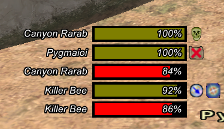

# enemylist

> A windower4 addon that automatically detects enemies and shows a list.

## Customization

Check out `data/settings.xml` for the stuff you can customize. Make changes, and reload the addon.

## Commands

- `//elist toggle` - allows you to toggle dragging

## Todo

- [ ] Show debuffs
